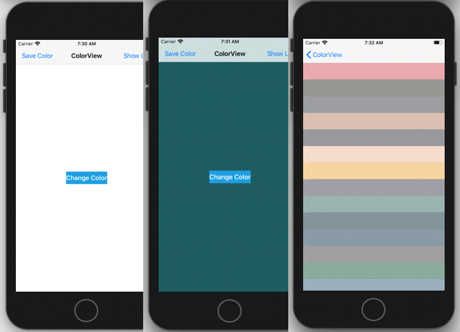

# ColorMind App 

## Description

A very simple app that gets random rgb  color from ColorMind API and changes the background view with that color. 
Can save the color you like and view all saved colors in a table list.

### Features 

- Contains multiple pages of interface in a navigation controller
- Persisting state on the device using Core Data
- Saved colors are shown in TableView 
- Downloading data from network resources

### How to use ?

1. Save on you favorite place 
2. Test it on xCode or deploy on your favorite device
